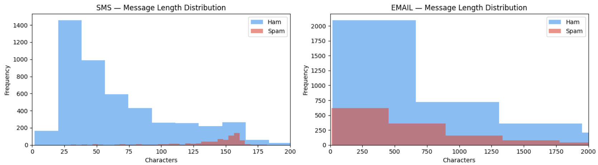
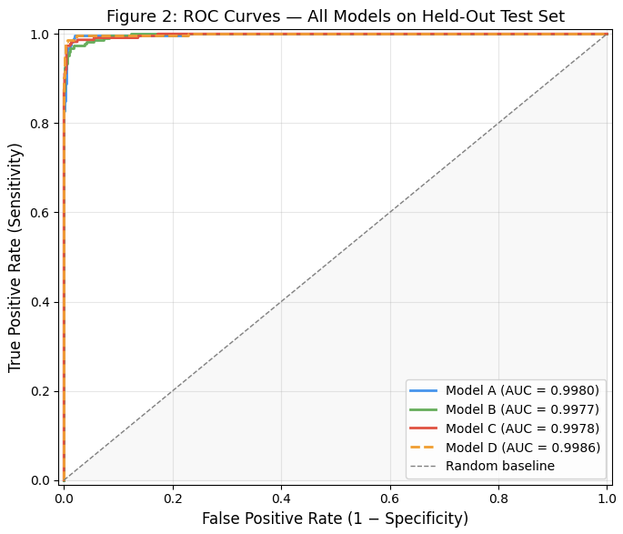
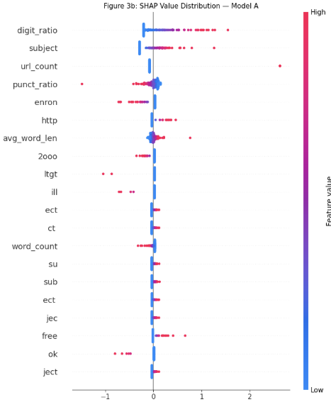
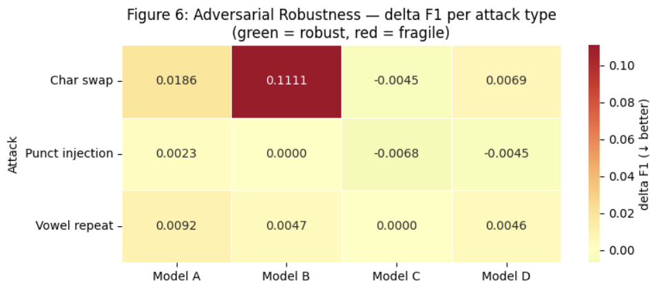
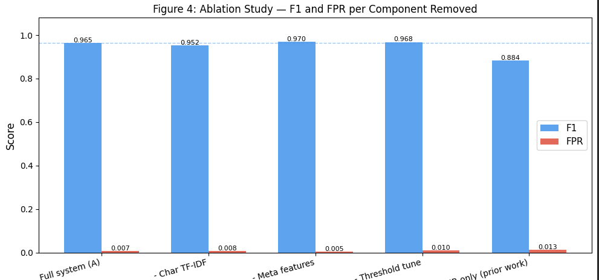

# 📧 DualSpam: Cross-Domain Spam Detection using Transformers


A research-oriented Natural Language Processing (NLP) project that investigates **cross-domain spam detection** across **SMS and Email** using **Transformer models, deep learning, ensemble learning, adversarial robustness evaluation, and explainable AI (SHAP)**.

The project provides a comprehensive experimental pipeline, comparing multiple machine learning and deep learning approaches while evaluating robustness, interpretability, and statistical performance.

---

# 📌 Project Overview

Spam detection remains an important cybersecurity problem due to constantly evolving spam generation techniques and text obfuscation attacks.

This project develops a unified framework capable of processing both **SMS** and **Email** spam datasets while evaluating:

- Classical Machine Learning models
- Deep Learning models
- Transformer-based models
- Ensemble learning
- Cross-domain generalization
- Adversarial robustness
- Explainable AI

---

# ✨ Features

- 📱 Unified SMS and Email spam detection
- 🤖 Transformer-based classification using DistilBERT
- 🧠 Bi-LSTM deep learning model
- 📊 Classical ML baseline comparison
- 🔄 Meta-stacking ensemble
- 🛡️ Adversarial robustness evaluation
- 🔍 SHAP explainability
- 📈 Comprehensive performance evaluation
- 📑 Ablation study
- 📊 Statistical significance analysis using McNemar's Test

---

# 🛠️ Tech Stack

### Programming Language

- Python

### Libraries

- PyTorch
- Hugging Face Transformers
- Scikit-learn
- Pandas
- NumPy
- Matplotlib
- Seaborn
- SHAP
- NLTK
- SciPy

---

# 🧠 Models Evaluated

- Logistic Regression
- Support Vector Machine (SVM)
- Random Forest
- Bi-LSTM
- DistilBERT
- Meta-Stacking Ensemble

---

# 📊 Exploratory Data Analysis

The project begins with exploratory analysis of SMS and Email datasets to understand message characteristics across domains.

<p align="center">

</p>

---

# 📈 ROC Curve Comparison

Receiver Operating Characteristic (ROC) curves compare the discrimination capability of all evaluated models on the held-out test set.

<p align="center">

</p>

---

# 🔍 Explainable AI using SHAP

SHAP (SHapley Additive exPlanations) was used to interpret model predictions and identify the most influential features contributing to spam classification.

<p align="center">

</p>

---

# 🛡️ Adversarial Robustness

The robustness of different models was evaluated against common text perturbation attacks such as:

- Character Swap
- Punctuation Injection
- Vowel Repetition

<p align="center">

</p>

---

# 🧪 Ablation Study

An ablation study was performed to analyze the contribution of major system components and quantify their impact on overall model performance.

<p align="center">

</p>

---

# 📈 Evaluation Metrics

The models were evaluated using:

- Accuracy
- Precision
- Recall
- F1 Score
- ROC-AUC
- False Positive Rate (FPR)
- Cross-domain evaluation
- SHAP Explainability
- McNemar Statistical Test

---

# 📂 Repository Structure

```
DualSpam-Transformer-Spam-Detection/
│
├── images/
│   ├── message_length_distribution.png
│   ├── roc_curve_comparison.png
│   ├── shap_summary_plot.png
│   ├── adversarial_robustness.png
│   └── ablation_study.png
│
├── DualSpam_Research_fixed.ipynb
├── requirements.txt
├── README.md
├── LICENSE
└── .gitignore
```

---

# 🚀 Installation

Clone the repository

```bash
git clone https://github.com/tharakvenkat/DualSpam-Transformer-Spam-Detection.git
```

Move into the project directory

```bash
cd DualSpam-Transformer-Spam-Detection
```

Install dependencies

```bash
pip install -r requirements.txt
```

Launch Jupyter Notebook

```bash
jupyter notebook
```

Open

```
DualSpam_Research_fixed.ipynb
```

---

# 📚 Dataset

This project utilizes publicly available SMS and Email spam datasets for research and educational purposes.

Data preprocessing, feature engineering, and experimental pipeline are fully documented within the notebook.

---

# 🚀 Future Work

- Streamlit Web Application
- FastAPI Deployment
- Multilingual Spam Detection
- Larger Transformer Models (RoBERTa, DeBERTa)
- Real-time Email Filtering API
- Continual Learning for Emerging Spam Patterns

---

# 📄 License

This project is licensed under the **MIT License**.

---

# ⭐ Support

If you found this project useful, consider giving it a ⭐ on GitHub.
